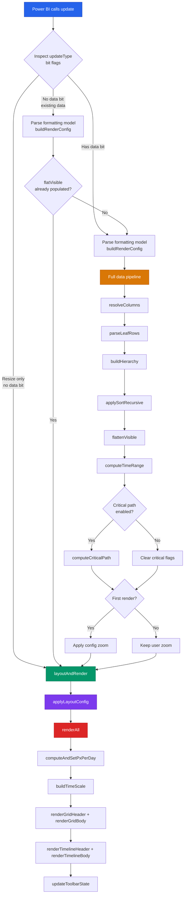
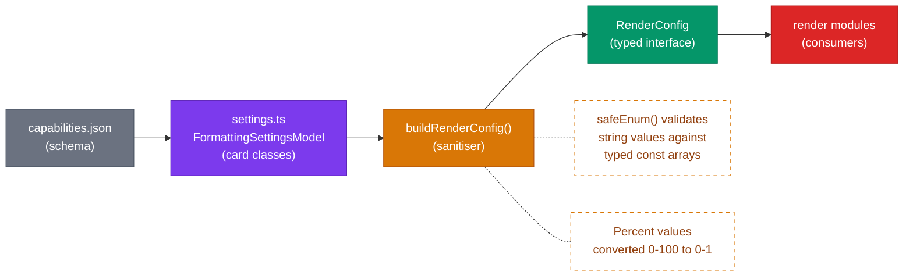

# Power BI Gantt Chart Custom Visual

A feature-rich Gantt chart custom visual for Power BI Desktop and Power BI Service, built with TypeScript and D3. Supports hierarchical task grouping, milestones, dependency lines, baseline (planned) bars, critical path analysis, and comprehensive formatting controls.

---

## Table of Contents

- [Features](#features)
- [Data Fields](#data-fields)
- [Getting Started](#getting-started)
- [Development](#development)
- [Project Architecture](#project-architecture)
- [Update Lifecycle](#update-lifecycle)
- [Formatting Options](#formatting-options)
- [Configuration Reference](#configuration-reference)
- [Build and Package](#build-and-package)
- [Linting](#linting)
- [Constraints and Limits](#constraints-and-limits)
- [License](#license)

---

## Features

- Hierarchical task grouping via multiple Task Name columns or explicit Parent field
- Expand / collapse nodes individually or in bulk (toolbar buttons)
- Milestones rendered as diamond markers with configurable styles
- Dependency lines between tasks (orthogonal, straight, or curved routing)
- Baseline (planned) bars shown alongside actual bars
- Critical path computation and highlighting
- Progress bars with overlay or bottom-stripe style
- Draggable split between grid pane and timeline pane
- Zoom levels: Day, Week, Month, Quarter, Year, Fit-to-viewport
- Search / filter tasks by name from the toolbar
- Scroll-to-today navigation
- Colour by resource, colour by status, or manual colour field
- Alternating row stripes, weekend shading, current week highlight
- Today line with configurable style, colour, and width
- Customisable scrollbar appearance (width, track/thumb colours, border radius)
- Fully customisable toolbar (show/hide individual controls, colours)
- Selection manager integration with Ctrl/Cmd multi-select
- Tooltips with custom tooltip fields
- WBS, resource, status, priority, duration, and progress columns in the grid
- 10,000-row data reduction cap (configurable in capabilities.json)

---

## Data Fields

The visual accepts data through the following field wells in Power BI. Required fields are marked with an asterisk.

| Field            | Required | Type              | Description                                                     |
|------------------|----------|-------------------|-----------------------------------------------------------------|
| Task Name *      | Yes      | Text              | One or more columns. Multiple columns create hierarchy levels.  |
| Start Date *     | Yes      | Date              | Task start date.                                                |
| End Date *       | Yes      | Date              | Task end date.                                                  |
| Task ID          | No       | Text / Number     | Unique identifier. Falls back to row index if not provided.     |
| Parent           | No       | Text / Number     | Parent task ID for explicit hierarchy (alternative to multi-column). |
| Progress         | No       | Number (0--1 or 0--100) | Completion percentage. Auto-normalised if > 1.            |
| Progress Base    | No       | Number            | Denominator when progress is a raw count (e.g. 3 of 5).        |
| Milestone        | No       | Boolean / Number  | Truthy value flags the task as a milestone.                     |
| Resource         | No       | Text              | Assigned resource. Used for colour-by-resource.                 |
| Dependencies     | No       | Text              | Comma-separated list of predecessor Task IDs.                   |
| Priority         | No       | Text              | Displayed in the grid priority column.                          |
| Status           | No       | Text              | Displayed in the grid status column. Drives colour-by-status.   |
| WBS              | No       | Text              | Work Breakdown Structure code shown in the grid.                |
| Planned Start    | No       | Date              | Baseline start date for planned/actual comparison.              |
| Planned End      | No       | Date              | Baseline end date for planned/actual comparison.                |
| Color            | No       | Text              | Hex colour override per task (e.g. `#FF5722`).                  |
| Tooltip Fields   | No       | Any               | Additional columns surfaced in hover tooltips.                  |

---

## Getting Started

### Prerequisites

- Node.js 18+
- Power BI Visual Tools: `npm install -g powerbi-visuals-tools`
- Power BI Desktop (for testing)

### Install

```bash
git clone <repository-url>
cd <project-directory>
npm install
```

### Run (development server)

```bash
npm start
```

This launches the pbiviz dev server on `https://localhost:8080` using `tsconfig.dev.json` (source maps and declarations enabled). Enable the developer visual in Power BI Desktop under Options > Report Settings > "Enable developer visual for testing".

### Package for distribution

```bash
npm run package
```

Produces a `.pbiviz` file in the `dist/` directory ready to import into Power BI Desktop or publish to your organisation.

---

## Development

| Command               | Description                                          |
|-----------------------|------------------------------------------------------|
| `npm start`           | Start dev server with hot reload (tsconfig.dev.json) |
| `npm run package`     | Build production .pbiviz package                     |
| `npm run lint`        | Run ESLint across all source files                   |
| `npm run sync-version`| Verify package.json and pbiviz.json versions match   |

### Build Configurations

Two TypeScript configurations are provided:

- **tsconfig.json** -- Used by `pbiviz package`. No source maps, no declarations. Optimised for production output.
- **tsconfig.dev.json** -- Extends tsconfig.json. Adds source maps and declaration files for development and debugging.

Both include the `files` array pointing to `src/visual.ts` (required by pbiviz tooling for webpack entry point resolution) and an `include` glob for all source modules.

---

## Project Architecture

The codebase is organised into 16 TypeScript modules grouped by responsibility. The visual class (`visual.ts`) acts as a thin orchestrator; all business logic is delegated to specialised modules.

```
src/
  visual.ts                 Orchestrator: DOM skeleton, update lifecycle, render dispatch
  types.ts                  Domain models, typed literal unions, RenderConfig interface
  constants.ts              Colour palettes, zoom presets, milestone marker styles
  settings.ts               Formatting model cards, factory helpers, buildRenderConfig()
  model/
    columns.ts              Data role to column index resolution
    parser.ts               Row-level parsing: DataViewTable row to GanttTask
    hierarchy.ts            Tree building, expand/collapse, sort, flatten, critical path
  layout/
    timeScale.ts            D3 time scale construction, pxPerDay computation
  render/
    grid.ts                 Task pane: header + body row rendering
    timeline.ts             SVG: bars, milestones, dependencies, backgrounds, today line
  ui/
    toolbar.ts              Toolbar DOM (zoom, expand/collapse, search, scroll-to-today)
    scrollbars.ts           CSS variable injection + webkit scrollbar style tag
  interactions/
    selection.ts            Selection manager integration, highlight/dim styles
  utils/
    date.ts                 Date coercion, daysBetween, format helpers
    color.ts                Status colour map, resource colour assignment
    dom.ts                  clamp(), el(), clearChildren()
style/
  visual.less               All visual styles, CSS custom properties for scrollbars
```

### Module Dependency Graph

```mermaid
graph TD
    subgraph Orchestrator
        V[visual.ts]
    end

    subgraph Configuration
        T[types.ts]
        C[constants.ts]
        S[settings.ts]
    end

    subgraph Model
        MC[model/columns.ts]
        MP[model/parser.ts]
        MH[model/hierarchy.ts]
    end

    subgraph Layout
        LT[layout/timeScale.ts]
    end

    subgraph Rendering
        RG[render/grid.ts]
        RT[render/timeline.ts]
    end

    subgraph UI
        UT[ui/toolbar.ts]
        US[ui/scrollbars.ts]
    end

    subgraph Interactions
        IS[interactions/selection.ts]
    end

    subgraph Utilities
        UD[utils/date.ts]
        UC[utils/color.ts]
        UDO[utils/dom.ts]
    end

    V --> S
    V --> MC
    V --> MP
    V --> MH
    V --> LT
    V --> RG
    V --> RT
    V --> UT
    V --> US
    V --> IS
    V --> UDO
    V --> UD

    S --> T
    S --> C
    RG --> T
    RG --> C
    RG --> UD
    RG --> UC
    RG --> UDO
    RT --> T
    RT --> C
    RT --> UD
    MP --> T
    MP --> UD
    MH --> T
    LT --> T

    style V fill:#2563EB,color:#fff,stroke:#1E40AF
    style S fill:#7C3AED,color:#fff,stroke:#5B21B6
    style T fill:#7C3AED,color:#fff,stroke:#5B21B6
    style C fill:#7C3AED,color:#fff,stroke:#5B21B6
    style MC fill:#059669,color:#fff,stroke:#047857
    style MP fill:#059669,color:#fff,stroke:#047857
    style MH fill:#059669,color:#fff,stroke:#047857
    style LT fill:#D97706,color:#fff,stroke:#B45309
    style RG fill:#DC2626,color:#fff,stroke:#B91C1C
    style RT fill:#DC2626,color:#fff,stroke:#B91C1C
    style UT fill:#0891B2,color:#fff,stroke:#0E7490
    style US fill:#0891B2,color:#fff,stroke:#0E7490
    style IS fill:#DB2777,color:#fff,stroke:#BE185D
    style UD fill:#6B7280,color:#fff,stroke:#4B5563
    style UC fill:#6B7280,color:#fff,stroke:#4B5563
    style UDO fill:#6B7280,color:#fff,stroke:#4B5563
```



---

## Update Lifecycle

Power BI calls the visual's `update()` method on every change: data load, formatting change, resize, view mode switch. The visual uses bit-flag inspection of `VisualUpdateType` to gate how much work each update performs.



All update paths converge on `layoutAndRender()`, which guarantees consistent sequencing: apply layout CSS first, then measure container dimensions, then render DOM. This prevents stale-measurement bugs where formatting changes alter the grid/timeline split but the render uses pre-change dimensions.

---

## Formatting Options

All options are accessible under Format Visual in Power BI Desktop. The visual organises settings into the following cards.

### Timeline

Default zoom level, today line (colour, width, style), weekend shading (colour, opacity), current week highlight, and timeline padding (extra days before/after task range).

### Task Settings

Row height, bar height, corner radius, progress display (overlay or bottom stripe), progress opacity, milestone size, sort field and direction, planned/baseline bar display, bar border styling, and group bar style (bracket, flat, or thin).

### Colours

Default bar colour, selected bar colour, group bar colour, dependency line colour, progress colour, milestone fill, planned bar colour, critical path colour, colour-by-resource toggle, colour-by-status toggle, and alternating row stripe colours.

### Grid Settings

Show/hide grid pane, default grid width, text size, indent size per hierarchy level, and toggles for individual columns: dates, resource, progress, duration, status, priority, WBS. Also configures grid line colour, header colours, font colour, and date display format.

### Bar Labels

Label content (name, progress, resource, dates, or combinations), label position (inside, right, left, auto), font size, and font colour.

### Dependencies

Show/hide dependency lines, line width, routing style (orthogonal, straight, curved), and arrow size.

### Critical Path

Enable/disable critical path computation, line width for critical dependency edges, and toggle for highlighting critical task bars.

### Header

Header row height, background colour, font colour, font size, axis line toggle, and axis line colour.

### Toolbar

Show/hide the entire toolbar, plus individual toggles for zoom buttons, expand/collapse all, scroll-to-today, and search box. Full colour control for toolbar background, button colours, and active button colours.

### Scrollbar

Scrollbar width, track colour, thumb colour, thumb hover colour, and border radius.

---

## Configuration Reference

The visual uses a type-safe configuration layer to bridge Power BI's formatting model and the render pipeline.



`buildRenderConfig()` in `settings.ts` is the single point where raw formatting values are read, sanitised, and converted into a `RenderConfig` object. All render modules consume `RenderConfig` exclusively and never access the formatting model directly. This ensures that invalid persisted values (e.g. a stale enum string from a previous version) are caught and defaulted rather than causing runtime errors.

---

## Build and Package

### Production

```bash
npm run package
```

Uses `tsconfig.json` (no source maps, no declarations). Output: `dist/<guid>.<version>.pbiviz`.

### Development

```bash
npm start
```

Uses `tsconfig.dev.json` (source maps + declarations). Launches webpack-dev-server on `https://localhost:8080`.

### Version Lockstep

The versions in `package.json` and `pbiviz.json` must match. Verify with:

```bash
npm run sync-version
```

This will exit with code 1 if the versions diverge.

---

## Linting

ESLint is configured with the Power BI visuals recommended ruleset plus project-specific rules:

| Rule                                            | Level | Threshold |
|-------------------------------------------------|-------|-----------|
| `max-lines-per-function`                        | warn  | 80 lines  |
| `complexity`                                    | warn  | 15        |
| `@typescript-eslint/no-explicit-any`            | warn  | --        |
| `@typescript-eslint/consistent-type-imports`    | warn  | --        |
| `@typescript-eslint/explicit-function-return-type`| warn | --        |
| `no-console`                                    | warn  | --        |
| `prefer-const`                                  | error | --        |

Run with:

```bash
npm run lint
```

---

## Constraints and Limits

- **Data reduction**: 10,000 rows maximum (configured in `capabilities.json` under `dataReductionAlgorithm`). This can be increased but may affect rendering performance with very large datasets.
- **D3 subpackages**: Only `d3-scale`, `d3-selection`, `d3-time`, and `d3-time-format` are imported (not the full D3 library) to minimise bundle size.
- **Power BI API**: Targets API version 5.3.0. The `VisualUpdateType` const enum is accessed via numeric bit-flag literals rather than symbolic names because pbiviz tooling compiles with `transpileOnly`, which strips const enum declarations from external modules.
- **Browser storage**: The visual does not use `localStorage` or `sessionStorage`. All view state (expand/collapse, zoom level, user-dragged grid width) is held in instance memory and resets when the visual is destroyed.
- **Certificate**: The `pbiviz start` dev server requires an SSL certificate. On systems without PowerShell (`pwsh`), automatic certificate generation will fail. You can generate one manually or use the webpack-dev-server fallback certificate.

---

## License

MIT