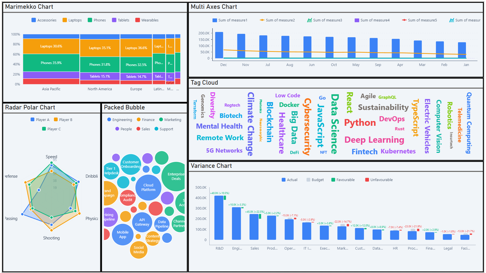

# Power BI Custom Visualisations

A suite of 17 custom Power BI visuals built with TypeScript and D3.js, sharing a unified design system and consistent architecture.



## Visuals

| Visual | Description |
|--------|-------------|
| **GanttChart** | Project timeline with hierarchies, milestones, dependencies, critical path, and baselines (reference implementation) |
| **advancedGauge** | Radial gauge with qualitative ranges, animated needle, and target marker |
| **advancedPieDonutChart** | Pie/donut chart with drill-down animation, configurable inner radius, and leader lines |
| **advancedTrellis** | Small-multiples grid supporting bar, line, area, and lollipop chart types |
| **bubbleScatterChart** | Scatter plot with bubble sizing, quadrants, trend lines, zoom/pan, play axis, and lasso selection |
| **bulletChart** | Stephen Few-style bullet chart with actual bar, target marker, and qualitative range bands |
| **hierarchicalVarianceTree** | Tree layout decomposing total variance into hierarchical contributing factors |
| **hierarchyFilterSlicer** | Tree-view slicer with checkboxes, search, and expand/collapse hierarchy filtering |
| **linearGauge** | Horizontal/vertical linear gauge with target markers, qualitative bands, and small-multiples |
| **marimekkoChart** | Mekko chart where both column width and segment height encode data |
| **multiAxesChart** | Combo chart supporting bar, line, and area series across up to 3 Y-axes |
| **packedBubble** | Force-directed packed bubble chart with optional group clustering |
| **performanceFlow** | Sankey diagram visualising flow and quantity between stages or categories |
| **radarPolarChart** | Radar/spider chart for comparing one or more series as polygons on a radial grid |
| **tagCloud** | Word cloud with words sized by measure, spiral placement, and rotation options |
| **varianceChart** | Actual vs Budget comparison with variance indicators (deltas, lollipops, arrows) |
| **waterfallChart** | Bridge chart showing initial value, incremental changes, and final total |

## Tech Stack

- **TypeScript 5.5** (strict mode, no `any`, no enums)
- **D3.js** (modular: d3-selection, d3-scale, d3-shape, d3-transition, d3-force, d3-hierarchy, etc.)
- **Power BI Visuals API 5.3.0** with pbiviz toolchain
- **LESS** for styling with shared theme variables
- **ESLint 9** with `@typescript-eslint` and `eslint-plugin-powerbi-visuals`

## Project Structure

```
powerbi-visualisations/
├── shared/theme/          # Design tokens, palettes, and LESS mixins
│   ├── palette.ts         # Canonical colour definitions (Slate, Blue, RAG, Resource)
│   ├── color-utils.ts     # Colour manipulation utilities
│   └── theme-base.less    # Shared LESS variables and mixins
├── build_all_visuals.sh   # Build all 17 visuals sequentially
├── sync_theme.sh          # Propagate shared theme into each visual's constants.ts
├── DEVELOPER-README.md    # Comprehensive style guide and architecture conventions
├── GanttChart/            # Reference implementation
├── advancedGauge/
├── ...                    # Each visual follows the same internal structure
└── waterfallChart/
```

Each visual follows a standardised internal layout:

```
<VisualName>/
├── pbiviz.json            # Visual metadata and API version
├── capabilities.json      # Power BI data roles and validation
├── package.json
├── src/
│   ├── visual.ts          # Entry point / orchestrator
│   ├── settings.ts        # Formatting model + buildRenderConfig()
│   ├── types.ts           # Domain interfaces and unions
│   ├── constants.ts       # Colour palettes (synced from shared theme)
│   ├── model/             # Data transformation (parse, hierarchy, sort)
│   ├── render/            # DOM/SVG drawing (stateless)
│   ├── layout/            # Scales and dimension calculations
│   ├── interactions/      # Selection and click handlers
│   ├── ui/                # Stateful widgets (toolbar, scrollbar)
│   └── utils/             # Pure helper functions
└── style/visual.less      # Imports shared/theme/theme-base.less
```

## Getting Started

### Prerequisites

- Node.js
- [Power BI Visual Tools](https://learn.microsoft.com/en-us/power-bi/developer/visuals/environment-setup) (`npm install -g powerbi-visuals-tools`)

### Development

```bash
# Install dependencies for a specific visual
cd GanttChart
npm install

# Start dev server (live reload in Power BI Service)
npm start

# Lint
npm run lint
```

### Building

```bash
# Package a single visual (produces .pbiviz file in dist/)
cd GanttChart
npm run package

# Package all 17 visuals
./build_all_visuals.sh
```

### Theme Sync

The shared design system lives in `shared/theme/`. To propagate changes into each visual:

```bash
# Sync all visuals
./sync_theme.sh

# Sync a single visual
./sync_theme.sh GanttChart
```

Synced sections in each visual's `constants.ts` are delimited by `[SHARED THEME START]` / `[SHARED THEME END]` markers -- do not edit these blocks manually.

## Design System

All visuals share a unified "Slate + Blue" design system:

- **Slate** (Tailwind-based) -- greyscale palette for UI chrome, text, backgrounds, and grid lines
- **Blue** -- accent colour for highlights, selection, and active states
- **Semantic colours** -- Red (danger/critical), Amber (caution), Emerald (success), Orange (at-risk)
- **Resource colours** -- 15-colour WCAG AA-safe palette for categorical data series
- **Status palette** -- RAG-style mapping for workflow states (not started, in progress, complete, delayed, etc.)

## Architecture

Each visual follows a strict module dependency graph:

```
visual.ts (orchestrator)
  ├── settings.ts      → Power BI formatting model
  ├── model/           → types, constants, utils/
  ├── render/          → types, constants, utils/
  ├── layout/          → types, constants, utils/
  ├── interactions/    → types
  └── ui/              → types, utils/
```

Key patterns:
- **RenderConfig** -- a single typed interface bridges the formatting model and all render code
- **No circular imports** -- strict top-down DAG from `visual.ts`
- **`as const` arrays** with derived union types instead of enums
- **Modular D3** -- only specific D3 modules are imported to minimise bundle size

See [DEVELOPER-README.md](DEVELOPER-README.md) for the full style guide, conventions, and contribution rules.

## License

MIT
